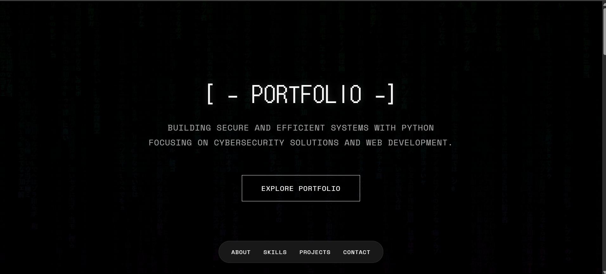

 Portfolio

This is a sleek, responsive, and modern personal portfolio website designed to highlight your skills, projects, and professional background. It functions as a digital resume and is ideal for developers, designers, or creatives who want to establish a strong online presence.


 🧰 Tech Stack

- **HTML5** – semantic structure and layout
- **CSS3** – responsive styling and layout
- **JavaScript** – interactive elements and behavior

 🚀 Features

- ✅ Fully responsive design
- ✅ Clean and modern UI
- ✅ Interactive transitions and animations
- ✅ Social media integration (GitHub, Instagram, LinkedIn, Twitter)
- ✅ Easy to customize and extend

📁 Project Structure

```
markz-portfolio/
├── index.html          # Main HTML file
├── styles.css          # Custom styles
├── scripts.js          # JavaScript for interactivity
├── assets/
│   ├── screenshot-home.png
│   ├── Demo.gif
│   ├── Github.png
│   ├── Instagram.png
│   ├── Linkedin.png
│   └── Twitter.png
└──.-.──
```

📸 Screenshots

🏠 Home Page



📽️ Demo Video


🧑‍💻 Author

LAZY DIV
GitHub: [@NAYAN-MONI0110](https://github.com/NAYAN-MONI0110)

📜 License

This project is licensed under the [MIT License](LICENSE). Feel free to use, modify, and distribute it as needed.

